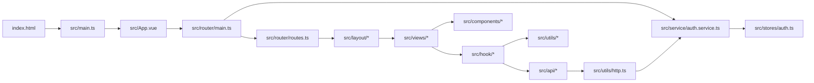
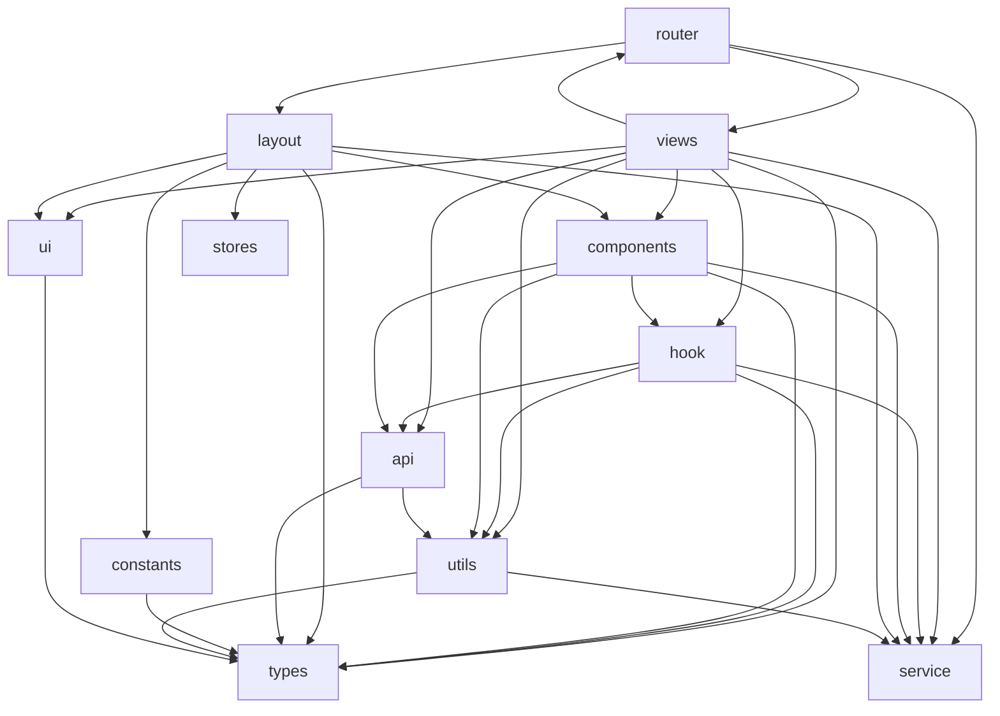

# XS Blog Web 前端依赖图谱

## 目的

- 用于快速定位当前前端项目的业务链路与目录入口。
- 只描述结构、分层、依赖方向与业务入口，不展开实现细节。
- 基于当前 `src/` 实际结构整理，适合作为最小阅读路径；比最初的目录草图更接近现状。

## 阅读顺序

推荐按下面的顺序定位业务：

1. `src/router/routes.ts`：先确认业务入口路由。
2. `src/layout/`：确认该路由挂在哪个布局壳层下。
3. `src/views/`：进入页面级组件。
4. `src/hook/`：查看页面背后的业务编排。
5. `src/api/`：确认接口资源边界。
6. `src/utils/http.ts` 与 `src/service/auth.service.ts`：查看通用请求与认证基础设施。

## 总体链路

## 路由分区

| 分区 | 路径前缀 | 主要布局 | 主要视图目录 | 说明 |
| --- | --- | --- | --- | --- |
| 公开区 | `/` | `AppLayout -> HomeLayout` | `views/home` `views/article` `views/link` `views/about` | 首页、文章、友链、关于 |
| 后台区 | `/admin` | `AppLayout -> AdminLayout` | `views/admin/*` | 用户、文章、标签、友链管理 |
| 编辑区 | `/admin/article/new` `/admin/article/edit/:id` | `AppLayout -> AdminEditorLayout` | `views/admin/article/editor.vue` | 编辑器单独布局 |
| 个人中心 | `/me` | `AppLayout -> MeLayout` | `views/me/*` | 个人资料、安全、收藏 |
| 登录注册 | `/login` `/register` | 独立页面 | `views/login/*` | 用户认证入口 |

## 模块规模

基于一级目录统计的当前文件数量：

| 模块 | 文件数 |
| --- | ---: |
| views | 15 |
| components | 19 |
| hook | 13 |
| api | 6 |
| layout | 7 |
| utils | 9 |
| constants | 4 |
| types | 3 |
| router | 2 |
| ui | 2 |
| service | 1 |
| stores | 1 |

结论：阅读入口优先级应是 `router -> layout -> views -> hook -> api`，其中 `views`、`components`、`hook` 是当前结构的主体。

## 一级模块依赖图

下面的扇入/扇出来自 `src/**/*.ts` 与 `src/**/*.vue` 中的 `@/模块/...` 导入关系，仅用于结构定位，不代表运行时调用次数。

### 扇出

| 模块 | 扇出目标数 | 导入引用数 | 说明 |
| --- | ---: | ---: | --- |
| views | 8 | 56 | 页面层是最大的依赖发起方，直接连接 hook、components、api、service、router |
| hook | 5 | 34 | 业务编排层主要向 api、utils、types 取能力 |
| components | 7 | 28 | 复用组件并不完全纯展示，部分组件会直接触达 hook/api/service |
| router | 4 | 23 | 主要负责装配 layout、views，并接入认证服务 |
| api | 2 | 17 | API 层基本只依赖类型与通用请求能力 |
| layout | 7 | 17 | 布局层承担导航、菜单、壳层拼装职责 |
| constants | 1 | 4 | 常量层只依赖类型 |
| utils | 2 | 2 | 工具层偏底层 |
| ui | 1 | 1 | UI 辅助层很薄 |

### 扇入

| 模块 | 扇入来源数 | 被引用数 | 说明 |
| --- | ---: | ---: | --- |
| types | 8 | 51 | 类型层是全项目共享底座 |
| hook | 3 | 30 | 视图层对 hook 的依赖最重，是业务定位核心入口 |
| utils | 4 | 27 | 通用工具承接请求、日期、校验等公共能力 |
| views | 1 | 16 | 基本只被 router 引用，符合页面装配职责 |
| api | 3 | 15 | 被 hook、views、components 共同依赖 |
| components | 3 | 15 | 主要被 views 与 layout 复用 |
| service | 6 | 9 | `AuthService` 等服务横向参与认证链路 |
| layout | 2 | 8 | 主要被 router 和 layout 自身组合引用 |
| constants | 2 | 5 | 菜单配置主要服务布局与组件 |
| ui | 2 | 3 | 体量小，但作为菜单和状态辅助存在 |
| router | 2 | 2 | 少量页面/编辑器会反向使用路由实例 |
| stores | 1 | 1 | 当前仅认证态直接使用 Pinia store |

### 关键依赖边

| 依赖边 | 次数 | 说明 |
| --- | ---: | --- |
| views -> hook | 23 | 页面逻辑优先收敛在 hook |
| router -> views | 16 | 业务入口集中在路由装配 |
| components -> types | 12 | 组件依赖共享类型较多 |
| hook -> types | 11 | hook 层大量承接查询/表单/响应类型 |
| api -> types | 11 | API 边界清晰，类型复用较稳定 |
| hook -> api | 10 | 业务编排层对接口层依赖明显 |
| views -> components | 9 | 页面主要通过复用组件组装 |
| views -> types | 9 | 页面层也直接消费业务类型 |
| hook -> utils | 8 | hook 内有较多通用工具协同 |
| views -> utils | 7 | 页面层仍保留一定工具调用 |

## 业务快速定位

### 1. 首页与文章列表

| 项 | 快速定位 |
| --- | --- |
| 路由入口 | `/` |
| 布局链路 | `AppLayout -> HomeLayout` |
| 页面入口 | `src/views/home/index.vue`、`src/views/article/index.vue` |
| 关键下游 | `src/components/article/list.vue`、`src/components/article/search.list.vue` |
| 业务编排 | `src/hook/article/useArticle.ts` |
| 接口资源 | `src/api/article/article.ts` |
| 定位建议 | 如果是首页展示或文章列表/搜索问题，先看 `routes.ts`，再看 `views/article/index.vue`，最后进入 `hook/article/useArticle.ts` |

### 2. 文章详情、阅读、评论、点赞、收藏

| 项 | 快速定位 |
| --- | --- |
| 路由入口 | `/article/:slug` |
| 页面入口 | `src/views/article/detail.vue` |
| 关键组件 | `components/article/detail.header.vue`、`components/article/comment.list.vue`、`components/vditor/*` |
| 业务编排 | `useArticleDetail`、`useAddView`、`useArticleComment`，位于 `src/hook/article/useArticle.ts` |
| 接口资源 | `src/api/article/article.ts` |
| 定位建议 | 详情页相关改动优先从 `detail.vue` 进入，它把内容渲染、目录、评论链路都挂到了同一页面入口 |

### 3. 登录与注册

| 项 | 快速定位 |
| --- | --- |
| 路由入口 | `/login`、`/register` |
| 页面入口 | `src/views/login/index.vue`、`src/views/login/register.vue` |
| 业务支撑 | `src/service/auth.service.ts` |
| 接口资源 | `src/api/user/user.ts` |
| 定位建议 | 认证问题通常是 `login/register view -> api/user -> AuthService -> store/http` 这条链 |

### 4. 友情链接前台与后台

| 项 | 快速定位 |
| --- | --- |
| 前台路由 | `/friend-link` |
| 后台路由 | `/admin/friend-link` |
| 页面入口 | `src/views/link/FriendLink.vue`、`src/views/admin/link/FriendLink.vue` |
| 业务编排 | `src/hook/link/useFriendLink.ts` |
| 接口资源 | `src/api/link/link.ts` |
| 关键组件 | `src/components/link/FriendLinkList.vue` |
| 定位建议 | 友链是较标准的 `view -> hook -> api` 结构，适合作为 CRUD 型业务样板 |

### 5. 个人中心

| 子业务 | 路由 | 页面入口 | 关键链路 |
| --- | --- | --- | --- |
| 基本信息 | `/me/base` | `src/views/me/base.vue` | `useUser` + `useSendEmail` + `useUplaodImgFile` |
| 安全设置 | `/me/security` | `src/views/me/security.vue` | `useUser` 或安全相关表单组件 |
| 收藏夹 | `/me/bookmark` | `src/views/me/bookmark.vue` | `hook/article/useArticle.ts` 中的收藏相关能力 |

补充入口：个人中心统一壳层在 `src/layout/me/index.vue`。

### 6. 后台用户管理

| 项 | 快速定位 |
| --- | --- |
| 路由入口 | `/admin/user` |
| 布局链路 | `AppLayout -> AdminLayout` |
| 页面入口 | `src/views/admin/user/index.vue` |
| 业务编排 | `src/hook/user/useUser.ts` |
| 接口资源 | `src/api/user/user.ts` |
| UI 辅助 | `src/ui/status/not-developed.ts` |
| 定位建议 | 后台表格类页面通常先看 `views/admin/*/index.vue`，再进入对应 hook |

### 7. 后台文章管理与文章编辑

| 子业务 | 路由 | 页面入口 | 关键链路 |
| --- | --- | --- | --- |
| 文章管理列表 | `/admin/article` | `src/views/admin/article/index.vue` | `useArticleList` + `useSession/useFiles/useDownload` + `api/article` |
| 新建文章 | `/admin/article/new` | `src/views/admin/article/editor.vue` | `useArticleEditor` + `api/tag` |
| 编辑文章 | `/admin/article/edit/:id` | `src/views/admin/article/editor.vue` | `useArticleDetailById` + `useArticleEditor` |

补充入口：编辑页使用单独的 `src/layout/admin/editor.layout.vue`，不要误从普通后台 layout 入口排查编辑器问题。

### 8. 后台标签管理

| 项 | 快速定位 |
| --- | --- |
| 路由入口 | `/admin/tag` |
| 页面入口 | `src/views/admin/tag/index.vue` |
| 业务编排 | `src/hook/tag/useTag.ts` |
| 接口资源 | `src/api/tag/tag.ts` |
| 定位建议 | 标签能力还会被文章编辑页与文章管理页复用，若是标签选择器问题可同时看 `views/admin/article/*` |

## 基础设施快速入口

| 目标 | 优先文件 |
| --- | --- |
| 看全局入口 | `src/main.ts`、`src/App.vue` |
| 看路由守卫/权限 | `src/router/main.ts` |
| 看业务路由分区 | `src/router/routes.ts` |
| 看全局请求封装 | `src/utils/http.ts` |
| 看登录态管理 | `src/service/auth.service.ts`、`src/stores/auth.ts` |
| 看菜单来源 | `src/constants/auth-menu.ts`、`src/constants/center-menu.ts`、`src/constants/me.menu.ts` |

## 快速结论

- 这是一个典型的 `router/layout/view/hook/api` 五层前端结构，业务定位优先找 `views` 与 `hook`。
- `types` 是最大扇入层，说明全局类型定义集中且稳定。
- `views -> hook -> api` 是最核心的业务追踪主链。
- `layout` 与 `constants/ui/service` 共同承接导航、权限与壳层拼装。
- 如果只需要快速定位业务，不建议先读 `components`；先确认路由和页面，再下钻到对应 hook 即可。